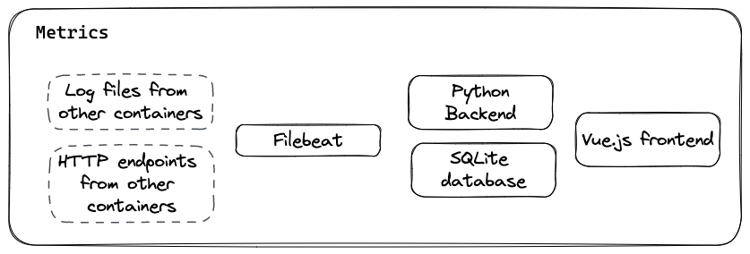

Metrics
=======

The `metrics` subsystem is responsible to transform raw data (e.g. web server logs) available on the offspot into business-oriented KPIs displayed on web dashboards.

The whole system is runing locally on the offspot. Dashboards are hence only presenting local offspot data.

At some point in the future, the system is meant to centralize data in a Cloud for aggregating multiple offspots. An intermediate data format is hence present, between raw data and KPIs.

## High-level overview

The backend is directly responsible to extract the various inputs from its environment (by reading rotating log files nicely, polling a webserver to grep some stats, ...).

This has been prefered to the use of an external program (e.g Filebeat, Logstash, ...) because what is needed is indeed limited (no complex processing), partially implemented in some libraries (e.g. watchdog) and there is no free lunch (no external program perfectly fitted to our use case). The integration of an external program is in addition not something straightforward.

The backend server is hence responsible to detect new raw logs received from Caddy reverse proxy, and transform them into inputs to compute indicator records.

On-the-fly, every indicator has a current state used to store intermediate computations that will be needed to create the final record value. This state is updated at each event.

Indicator states are kept in memory. They are transfered to the SQLite database every minute (this is mandatory since it is quite common that the offspot is not shutdown properly).

When the backend starts, it first reloads this state data from database.

Every hour, the backend server process automatically the indicator states to create indicator records. It then computes/updates KPI aggregations. Indicator records and KPI aggregations are immediately persisted to the SQLite DB.

KPI aggregations do not rely on an in-memory state, they reuse as many indicator records as necessary every time.

The backend is serving the KPI data via a REST API.

A Vue.JS application serves dashboards of the KPI data.

## Integration

The `backend` assumes that:
- a Caddy reverse proxy is used, and the folder where its logs are output is mounted in the `/reverse-proxy-logs` folder
    - we assume that logs are written in JSON ; we support rotated log files ; we do not supported compressed rotated files
- some data is persisted accross process restarts:
  - an SQLite database, location based on `DATABASE_URL` environment variable
  - one JSON file currently used by the log watcher, stored in the folder located at `LOGWATCHER_DATA_FOLDER` environment variable
  - in the Docker image, by default both are in the `/data` folder which should be mounted as a volume
- a `packages.yml` file is mounted in `/conf/packages.yml` or any other location passed via the
`PACKAGE_CONF_FILE` environment variable ; this file contains the `offspot` packages configuration and
 its format is an `offspot` [convention](https://github.com/offspot/container-images/tree/main/dashboard)
    - we parse the list of `packages` and process the `kind`, `title` and `url` attributes
    - we assume that `url` attribute matches the `^//(?P<host>.*?)/.*` regular expression to extract
    host name and use it afterwards when matching reverse proxy log lines with the correct package
    - when `kind` is `zim`, we use extract zim alias from `url` attribute and use it afterwards when
    matching reverse proxy log lines with the correct ZIM. Regexp must match:
      - either the `^//.*?/viewer#(?P<zim>.*)$` regexp
    (e.g. //kiwix.local/viewer/viewer#sqa.stackexchange.com_en_all_2023-05)
      - or the `//.*?/content/(?P<zim>.+?)(?:/.*)?$` regexp
    (e.g. //kiwix.local/content/sqa.stackexchange.com_en_all_2023-05/a_super_home_page)
- `kiwix-serve` is serving resources through the `/content` url. More precisely, we assume that access logs
on `kiwix-serve` are matching the `^/content/(?P<zim>.+?)(?P<item>/.*)?$` regular expression when a ZIM
resource is displayed (where `zim` is the zim alias mentionned above, extracted from the `packages.yml`
configuration file)

## SQLite

SQLite is **highly resistant to corruption**, even when a power failure occurs in the middle of a transaction. However, [corruption might still occur](https://www.sqlite.org/howtocorrupt.html).

Probability is however very low, [detection](https://www.sqlite.org/pragma.html#pragma_integrity_check) is time/resource-consuming, fully automated recovery is highly improbable (aside from restoring as many records as possible, we also need to perform applicative recovery for consistency).

Moreover, since there is little chance that this corruption targets more specifically SQLite database than any other part of the system (which have no recovery mechanism), the risk is assumed and no [recovery](https://sqlite.org/cli.html#recover) is implemented for SQLite DB.

Backups of the DB are not considered either since the disk space is constrained in our situation, and we can reasonably assume that we need to keep many backups since detection of corruption might be many days after it occurs.
